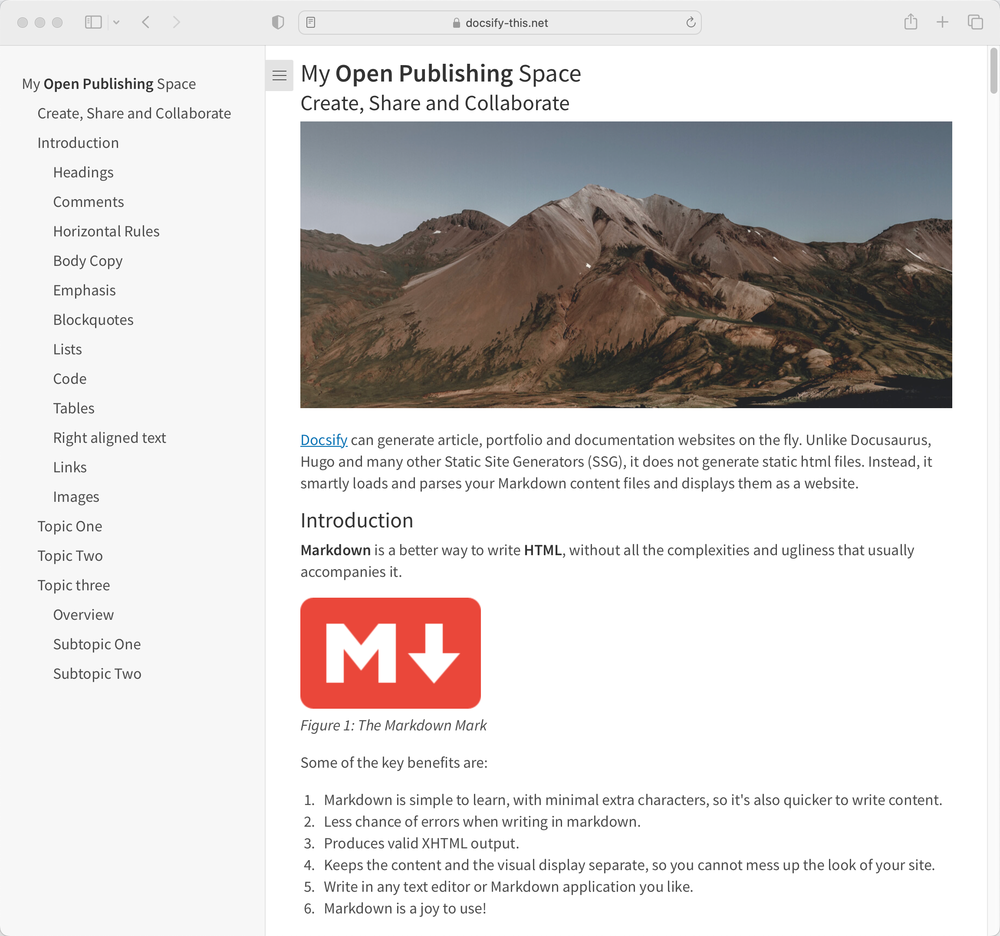

# Docsify This One Page Article Template

> This is a one page article template for use with [Docsify-This.net](https://docsify-this.net/#/).

_Figure 1. Docsify Docsify This One Page Article Template. Explore the resulting standalone web page generated by Docsify-This.net at [https://docsify-this.net/?basePath=https://raw.githubusercontent.com/paulhibbitts/docsify-this-one-page-article-template/main&homepage=home.md&sidebar=true&maxLevel=3](https://docsify-this.net/?basePath=https://raw.githubusercontent.com/paulhibbitts/docsify-this-one-page-article-template/main&homepage=home.md&sidebar=true&maxLevel=3)_

How to Use
---

1. Tap **Use this template** on the source repository (upper-right green button) and then choose **Create a new repository**

2. Choose the name for your new repository to contain the files and then tap **Create repository from template**

3. Locate the **home.md** Markdown file, open it, and copy it's URL

4. Go to https://docsify-this.net and paste the copied URL into the **Markdown File URL** field

5. Tap the **View as Standalone Page** button to view your Markdown file as a web page

Docsify-This Examples
---

[Docsify This One Page Article](https://github.com/paulhibbitts/docsify-this-one-page-course/blob/main/home.md), displayed by Docsify-This as a:  
* [Standalone Page](https://docsify-this.net/?basePath=https://raw.githubusercontent.com/paulhibbitts/docsify-this-one-page-article/main&homepage=home.md#/ "Docsify This One Page Article")  
* [Standalone Page with Table of Contents including h2 and h3 Headers](https://docsify-this.net/?basePath=https://raw.githubusercontent.com/paulhibbitts/docsify-this-one-page-article/main&homepage=home.md&toc=true&toc-headings=h2,h3#/ "Docsify This One Page Article")
* [Standalone Page with Docsify Sidebar with maxLevel of 3 (H3)](https://docsify-this.net/?basePath=https://raw.githubusercontent.com/paulhibbitts/docsify-this-one-page-article/main&homepage=home.md#/&sidebar=true&maxLevel=3 "Docsify This One Page Article")